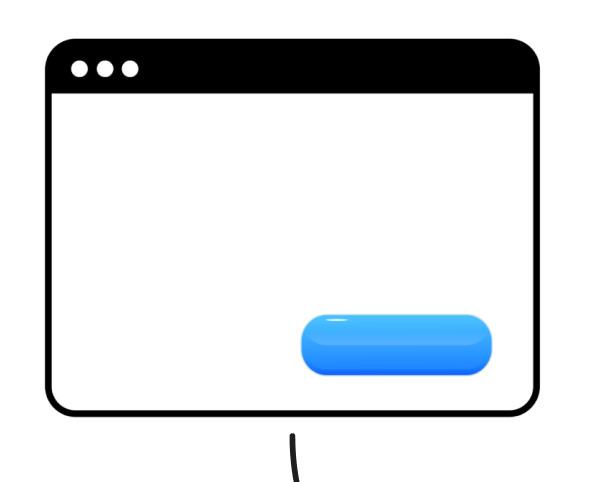
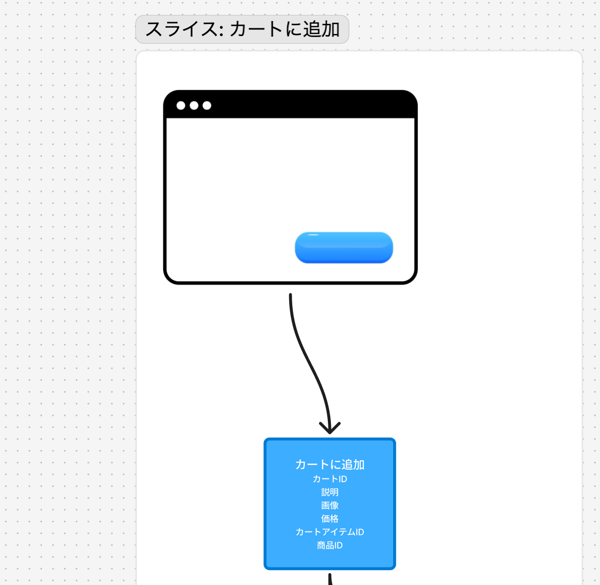
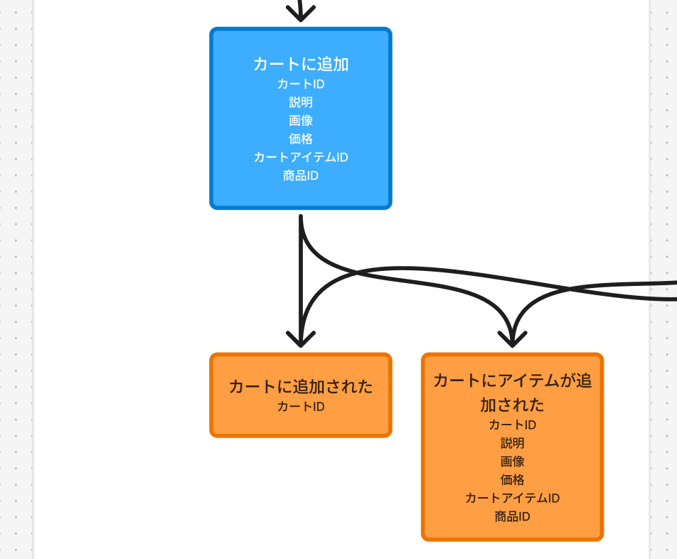
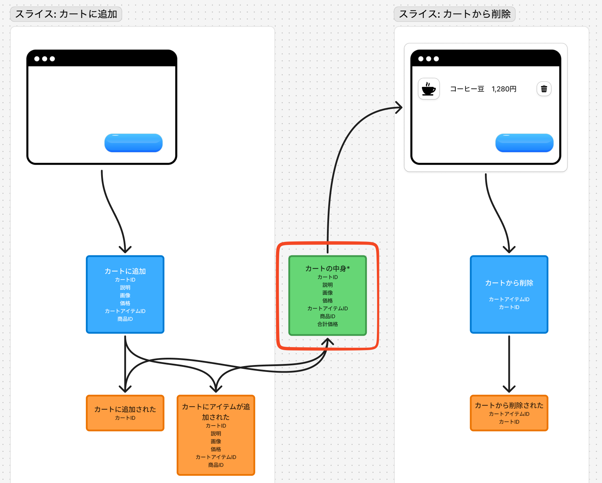
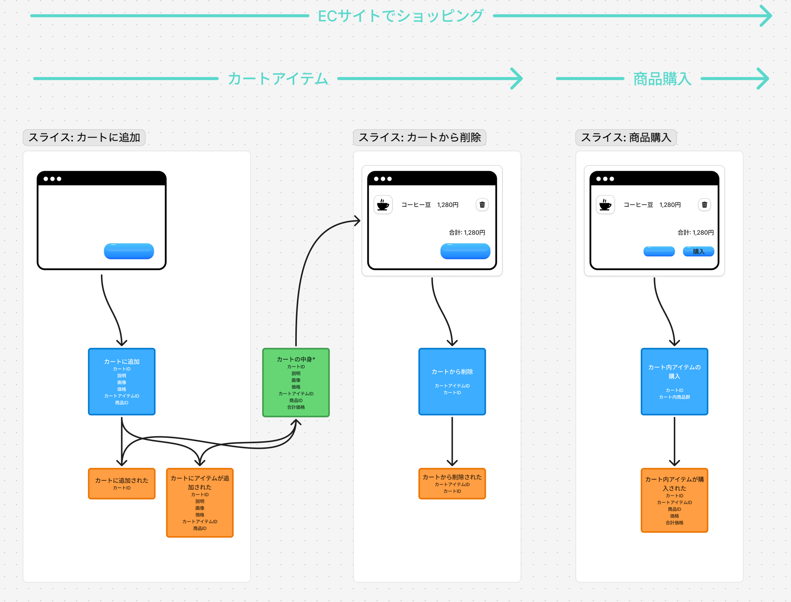
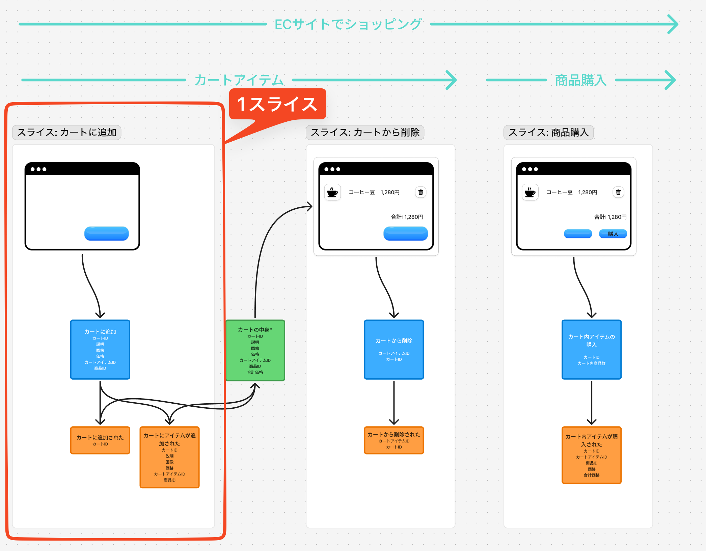
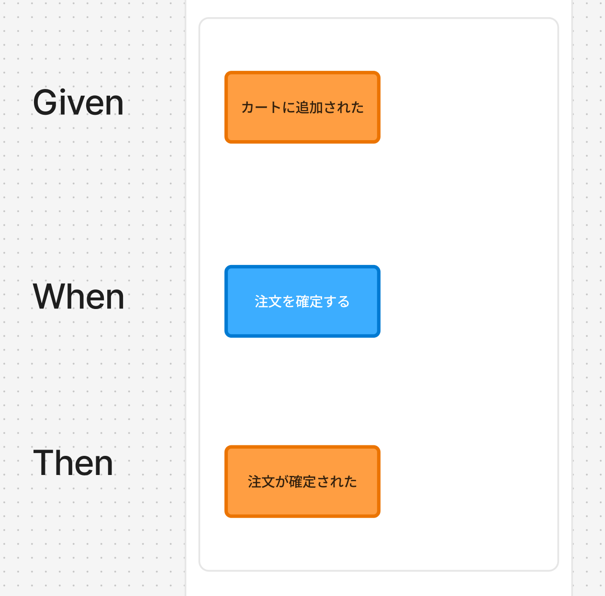
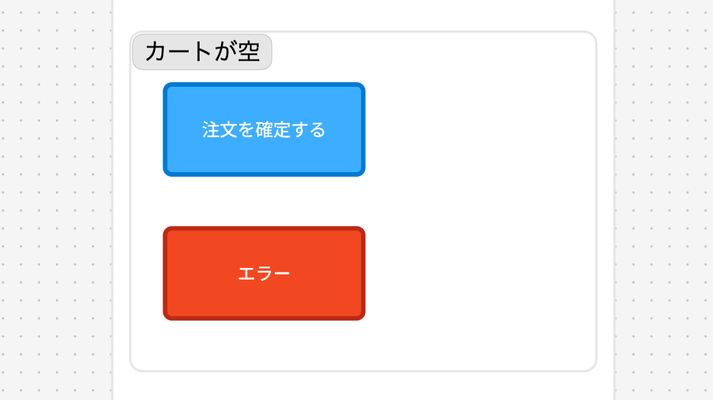

## TL;DR

- イベントモデリングは、システムを「情報の流れ」として時間軸に沿って可視化する手法
- 画面（UI）、コマンド、イベント、ビューの4つの要素で構成される
- 縦方向の断片（「スライス」と呼ぶ）でタスク分割ができ、実装の見通しが立てやすい（特にCQRS+ES採用時に相性が良い）
- CQRS/Event Sourcing との相性は良いが、特定の技術に紐づかず考えることができる

## はじめに

イベントモデリング（Event Modeling）という手法を使い始めて、約3年が経ちました。この記事では、私が実際に使ってみて感じたことや、現時点での理解を共有したいと思います。

:::message
この記事は、イベントモデリングという手法を初めて知る方、または名前は聞いたことがあるが実践イメージが湧かない方を想定しています。CQRS や Event Sourcing の知識は前提としませんが、後半で言及があります。
:::

正直なところ、まだ「完全に理解した」とは到底言えません。ただ、実践を通じて「こういうことなのかな」という感覚が掴めてきたのと、これまで続けてきてよかったなとは思えているので言語化しておきたいと思いました。

:::message
この記事は私個人の経験と解釈に基づいています。イベントモデリングについてより正確な情報を得たい方は、提唱者である Adam Dymitruk 氏の公式サイト（eventmodeling.org）を参照されることをお勧めします。
:::

## なぜイベントモデリングに興味を持ったのか

私がイベントモデリングに興味を持ったきっかけは、開発フローにおける認識のズレや不確定さに悩んでいたからです。

開発をしていると、PO（プロダクトオーナー）やビジネスサイドの担当者、デザイナーといった多くの方との連携があります。以前は、議論が抽象的になりがちで「どの画面の話をしてるの？」となったり、考慮漏れがあとからわかって手戻りになったりすることがありました。

要件の共通理解から実際の開発まで、チーム内で認識がズレることなくスムーズに進める方法はないだろうか ― そんなことを考えながら調べているうちに、偶然イベントモデリングという手法に出会いました。

「これは使えるかもしれない」と感じて、試してみることにしたのが始まりです。

なお、同様の課題を解決する手法としては、ユーザーストーリーマッピングやシーケンス図、ユースケース図なども存在します。どれが正解とか、どちらの方が良いということを言いたいわけではなく、私の場合はたまたまイベントモデリングに出会い、タイミング的にフィットしたというのが正直なところです。

大事なのは、イベントモデリングはあくまで**コミュニケーションツール**であり、手段であって目的ではないということです。チーム内で認識を揃え、議論を円滑にすることが本来の目的であり、その目的を達成できるなら他の手法でも全く問題ないと思っています。

私がイベントモデリングを気に入っている理由は、**UIを明示的に含める**点です。「画面とアクションの紐づけ、そしてそこから生み出される重要なイベント」という見た目が、非技術者にとってもとっつきやすく、システムの流れが後から見てもつかみやすいと感じています。

## イベントモデリングとは

イベントモデリングは、Adam Dymitruk 氏によって提唱された手法です。


> Event Modeling is a method of describing systems using an example of how information has changed within them over time. It was developed at Adaptech Group by Adam Dymitruk. Event Modeling specifically omits transient details and looks at what the information flow is and what the user sees at any particular point in time. These are the events on the timeline that form the description of the system. (eventmodeling.org 冒頭より引用)

私なりに理解すると、イベントモデリングは**システムの動きを「情報の流れ」として時間軸に沿って描く**手法です。

ポイントだと感じているのは、**UI（画面）を明示的に含める**という点です。「ユーザーが何を見て、何を操作し、その結果何が起こるのか」という一連の流れを可視化します。（厳密にはユーザーをオートメーションとしても考えるため、必ずしもUI（画面）に閉じた話ではありません。ただし、この記事のスコープ外としてその点については触れません）

これによって、非技術者の方にも「ああ、この画面でこのボタンを押すとこうなるのね」と理解してもらいやすくなる ― というのを実感しています。

## 4つの構成要素

イベントモデリングでは、4つの要素でシステムを表現します。コマンド、イベント、ビューの3つは色で区別するのが慣例となっており、一目で何を表しているかわかるようになっています。私が実践で使っている理解をまとめてみます。

### 1. 画面（UI / Wireframe）



ユーザーが実際に目にするインターフェースです。画面は色ではなく、ワイヤーフレームやモックアップの画像として表現します。

多くの場合ここにワイヤーフレームやモックアップを直接貼り付けます。これがあると、ビジネスサイドの方との会話がスムーズになります。「この画面の話をしているんだよね」と指差しながら議論できます。

### 2. コマンド（Command）- 青色



ユーザーのアクションや、外部システムからの入力を表します。

コマンドは「意図」や「命令」です。重要なのは、**コマンドは失敗することがある**という点。在庫がなければ注文は確定できませんし、バリデーションで弾かれることもあります。

例：
- 「注文を確定する」
- 「商品をカートに追加する」

### 3. イベント（Event）- オレンジ色



コマンドが成功した結果として記録される「事実」です。

イベントは**常に過去形**で書くということを意識しておく必要があります。「注文が確定された（OrderConfirmed）」のように。これは「すでに起こったこと」だからです。

例：
- 「注文が確定された」
- 「商品がカートに追加された」

### 4. ビュー / Read Model - 緑色



画面表示用のデータです。「この画面を表示するために必要なデータ構造」と考えるとわかりやすいです。

シンプルに言えば、「この画面に表示するデータベースのクエリ結果」です。カート画面であれば「カートの中身一覧」、注文履歴画面であれば「過去の注文リスト」といった形になります。

Event Sourcing を採用している場合は、「どんなイベントを集約すればいいか」という観点で考えることもできます。たとえば「商品がカートに追加された」「商品がカートから削除された」といったイベントの履歴から「現在のカートの中身」を導出する、というイメージです。

どちらのアプローチでも、「画面が必要とするデータ」を明示するという点で役立ちます。

---

これら4つの要素を時間軸に沿って配置することで、システム全体の情報の流れが見えるようになります。次のセクションで、実際にどう描くのかを見てみましょう。

## 実際に描いてみる

言葉で説明するより、実際の流れを見たほうがわかりやすいと思います。私がよく使う EC サイトの例で示してみます。

私は FigJam を使ってイベントモデルを描いています。オンラインでチームと共同編集できるので、リモートワークでも問題なく使えています。他にも Miro や draw.io、あるいはホワイトボードや紙とペンでも描くことができますが、個人的にはオンラインツールの方が継続的に更新しやすいと感じています。

### シナリオ：ユーザーが商品を購入する

以下は、ECサイトで「商品をカートに追加し、注文を確定する」というフローをイベントモデルで描いた例です。

<!-- TODO: FigJamで作成したイベントモデルのスクリーンショットを追加 -->


*画面（上段）→ コマンド（青）→ イベント（オレンジ）→ ビュー（緑）が時間軸に沿って並ぶ*

青はコマンド、オレンジはイベント、緑はビュー、という具合です。画面部分にはワイヤーフレームやモックアップの画像を直接貼り付けています。

イベントモデルの基本的な配置について補足します：

- **縦方向の構成**: 上から「画面」→「コマンド」→「イベント」→「ビュー」の順に配置します。これは情報の流れを表しています
- **時間軸の方向**: 左から右に向かって時間が進みます。つまり、左側が「最初のアクション」、右側が「後続のアクション」となります
- **要素間の線**: 各要素は矢印で接続され、データや処理の流れを示します。コマンドからイベントへの矢印は「コマンドが成功するとこのイベントが発生する」ことを意味します

こうやって描くと、「システム全体でどういう情報が流れているのか」が見えてきます。私にとっては、これがイベントモデリングの価値だと感じています。

## タスクへの落とし込み：スライス

イベントモデリングを実践してみて一番「これは使える」と感じたのが、**スライス（Slice）** という考え方です。

### スライスとは（私の理解）

スライスは、イベントモデルの「縦方向の断片」です。



イベントモデリングでは、一つのスライスを一つの作業単位として扱っています。「この画面で、このコマンドを実行したら、このイベントが記録されて、このビューが更新される」という一連の流れをひとまとめにする感じです。

### なぜスライス単位のタスク分割がうまくいくのか

スライスが有効だと感じる理由は、**入力から出力までの一連の流れが明確に定義されている**からです。

よくあるタスク分割（「画面を作る」「APIを作る」「DBを設計する」など）では、それぞれが独立して進み、結合時に「あれ、想定と違う」となることがあります。これは、各担当者が異なるゴールを見ながら作業を進めてしまうことが原因だと考えています。

スライス単位で考えると、最初から「この入力に対してこの出力が得られる」という契約が定義されます。画面、コマンド、イベント、ビューという縦方向の依存関係が可視化されているため、暗黙の仮定が減り、各担当者が同じゴールを見ながら作業できるようになります。結果として、認識のズレが起きにくいと感じています。

### Given-When-Then との相性

スライスは、テストでよく使われる「Given（前提条件）-When（操作）-Then（期待結果）」という形式で表現できます。

```
Given: カートに商品Aが1つ入っている
When: 「注文を確定する」ボタンをクリックする
Then: 「注文が確定された」イベントが記録される
```



これがそのままテストケースに転写しやすい構造になっているのも特徴の一つです。特に CQRS+Event Sourcing（後述）を採用している場合は、Given-When-Then の構造がそのままコードに対応するため、テストコードへの落とし込みがスムーズになります。

例えば、上記のスライスをテストの観点で整理すると、以下のようなイメージになります：

```
テスト: カートに商品がある状態で注文を確定すると、注文確定イベントが記録される

前提条件（Given）:
  - カートID「cart-1」が存在する
  - カートに商品A が 1個 入っている

操作（When）:
  - 「注文を確定する」コマンドを実行する

期待結果（Then）:
  - 「注文が確定された」イベントが記録される
  - イベントにはカートID と注文内容が含まれる
```

このように、スライスの Given-When-Then がそのままテストケースの骨格になります。具体的な実装方法はフレームワークやアーキテクチャによって異なりますが、テストの構造自体はスライスから導出できます。

### エラーケースの扱い

なお、イベントモデリングでは、エラーケース（コマンドが失敗するケース）はスライスの下に Given-When-Then 形式で描きます。様々なケースでタイムラインを分岐させることはしません。専用のワークフローがある場合は、別のイベントモデルとして扱うことが推奨されています。**分岐を行わない**ことが重要なポイントです。



### タスク分割が楽になった

これまでタスク分割には結構悩んでいました。「チケットはどのくらいの大きさにすると良いだろう？」という曖昧さがあったんですよね。

スライス単位でタスクを切るようになってから、「このスライスが動けば完了」という明確な基準ができました。スライスの規模はビジネスロジックの複雑さによって異なりますが、少なくとも「何をもって完了か」が明確になるため、見積もりの精度が上がったと感じています。

CQRS+Event Sourcing（後述）を採用している場合はより自然にフィットしますが、CRUDベースでもスライス単位での開発は十分に可能です。

## CQRS・Event Sourcing との関係

イベントモデリングの話をすると、上にも何度か書いたようにCQRS や Event Sourcing という言葉がよく出てきます。

簡単に説明すると、**CQRS（Command Query Responsibility Segregation）** は書き込み（コマンド）と読み取り（クエリ）の責務を分離するアーキテクチャパターンです。**Event Sourcing** は、状態そのものではなく「状態の変更（イベント）」を永続化し、イベントの履歴から現在の状態を導出するパターンです。

なお、公式サイトでは CQRS や Event Sourcing という用語自体は明示的に使われていません。ただし、「コマンドとビューの分離」「イベントを履歴として保持する」といった概念は共通しており、これらの技術パターンと親和性が高いことがわかります。

私の経験では、イベントモデリングとこれらの技術パターンは**相性が良いけど、必須ではない**という関係です。CQRS+Event Sourcing を採用した場合に特に相性の良さを感じました。

### なぜ相性が良いのか

CQRS+Event Sourcing を採用している場合、イベントモデルで描いた設計がそのまま実装の構造に対応します。具体的には、イベントモデル上の「コマンド」「イベント」「ビュー」が、実装上のコンポーネントと1対1で対応するため、設計と実装の乖離が少なくなります。

また、スライスの Given-When-Then がそのままテストパターンに対応するため、テストコードへの落とし込みもスムーズです。

### 必須ではない理由

とはいえ、従来の CRUD ベースのアプリケーションでも、イベントモデルを描くこと自体は可能です。私の関わるプロジェクトでは、Event Sourcing を採用していないことの方が多いのですが、イベントモデリングは設計のガイドとして十分に役立っています。

**考え方のフレームワークとして使う**というスタンスでやっています。

## 実践してみて感じたこと

以下は約3年間の実践を通じて感じたことです。定量的な検証はしていませんが、主観的な実感として共有します。

### 良かった点

**全体を俯瞰しやすくなった**

イベントモデルを描くことで、機能を満たすための一連のフローが可視化され、その中にあるスライスの数も見やすくなりました。これにより、チーム内で規模感についても共通認識を持ちやすくなったと感じています。

**考慮漏れに早く気づけるようになった**

以前は実装が進んでから「あ、このケース考えてなかった」と気づくことがありました。イベントモデルを描くようになってから、そういった考慮漏れが減りました。完全にはなくなっていませんが、ワークフロー全体を可視化することで、早い段階で「ここはどうなるの？」という議論ができるようになりました。

**非技術者との会話がスムーズになった**

画面が含まれているので、「この画面の話をしてるんだよね」と指差しながら議論できます。以前は抽象的な説明になりがちで「結局どういう動きになるの？」と聞き返すことがありましたが、イベントモデルを見ながら話すことで、そういった確認が減ったと感じます。

**タスクの切り方が明確になった**

スライス単位で考えるようになって、「何を作ればいいか」「どこまでやったら完了か」が明確になります。

**チーム内の認識合わせに使える**

「このシステムってどう動くんだっけ」という質問に、イベントモデルを見せながら説明できるようになります。これがそのままオンボーディングにも使えたりするので、副次的な効果が多いと感じます。

### 難しいと感じる点

**なんだかんだで描き方に迷う**

「どこまで細かく描けばいいのか」「この粒度で合ってるのか」と迷うことがあります。「これが正解だ！」というものは無いと思っています。「共通認識」をもつためのツールという役割がメインだと思っています。なので、イベントモデリングをステークホルダーと育てることでどのように書くのかがつかめてくるものなのだと思っています。（プロジェクトや現場によって変わるもの）

**メンテナンスの手間**

システムが変わったらイベントモデルから更新しないと、乖離が生まれます。一度更新を怠ると、どんどんメンテナンスされなくなり、価値がどんどん下がってしまいます。イベントモデリングの効果を感じるような運用を常に意識することが大事です。そのチームやプロジェクトに合った、最適な方法を模索し続けることが大事です。チームによっては、矢印などの詳細を省略して暗黙の了解で進めることもあるようです。描き方の厳密さよりも、チーム内で認識が合っていることの方が重要だと考えています。

**チームへの説明コスト**

新しい手法を導入するので、チームメンバーへの説明が必要です。そしてイベントモデリングに関する資料が圧倒的に不足しています。ただし、イベントモデリング自体はさほど難しいことをするわけではないので、イメージは新しいメンバーにも伝わりやすい印象があります。

## まとめ

イベントモデリングを実践してみて、私なりに理解したことをまとめてみました。

- システムを「情報の流れ」として捉え、時間軸に沿って可視化する手法
- 画面（UI）、コマンド、イベント、ビュー の4つの要素で構成
- スライス単位でタスク分割ができるのが実用的
- CQRS/ES との相性は良いが、特定の技術に紐づかずに活用できる

まだ試行錯誤の段階ですが、設計の指針として十分に価値があると感じています。

もし興味を持った方がいれば、公式サイト（eventmodeling.org）や Adam Dymitruk 氏の発信を参照されることをお勧めします。私の理解が間違っている部分もあるかもしれないので、ぜひ一次情報にあたってみてください。

## 参考リンク

- [eventmodeling.org - 公式サイト](https://eventmodeling.org/)
- [Adam Dymitruk のXアカウント](https://x.com/adymitruk)
